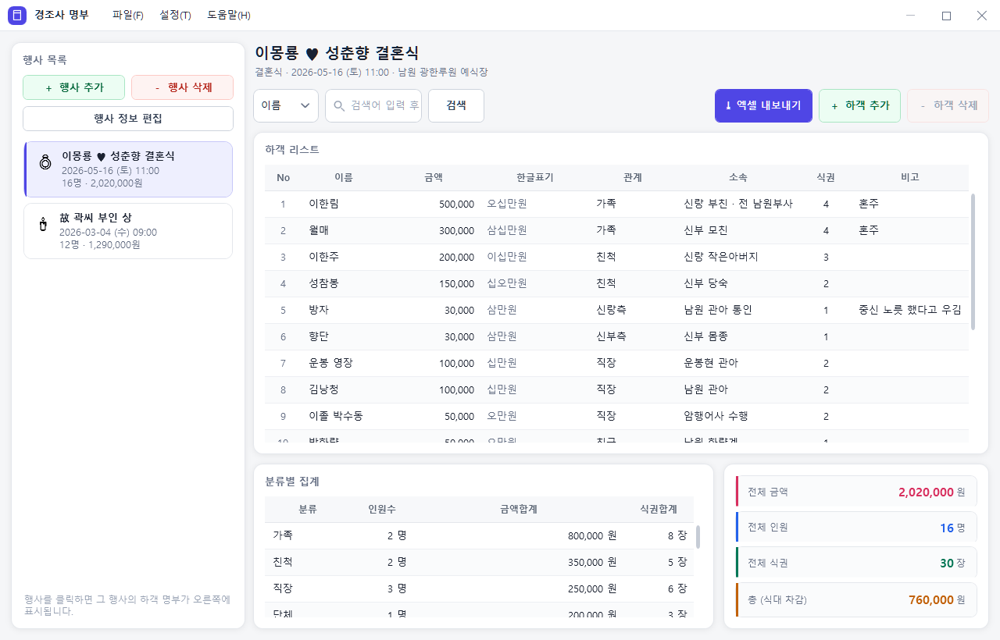
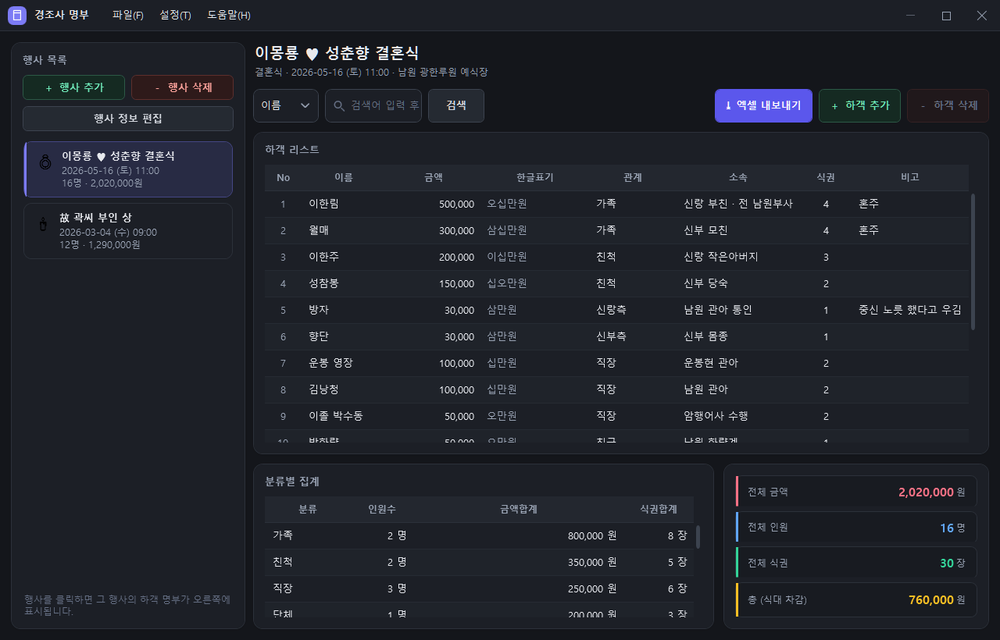
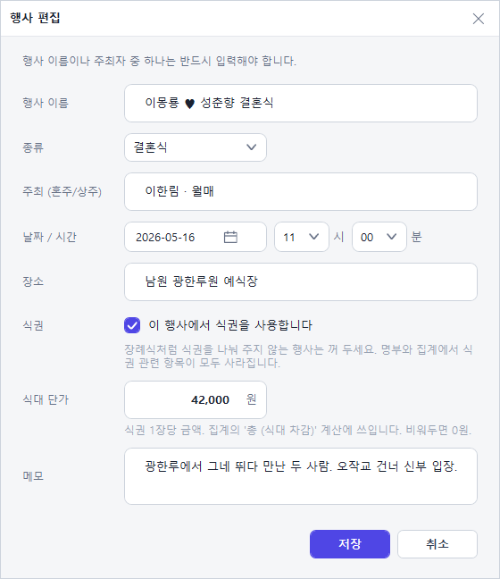
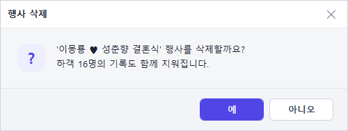
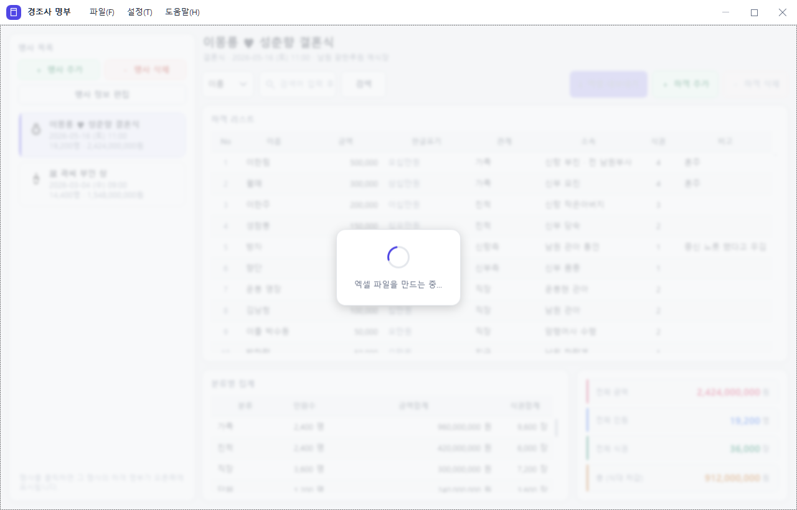
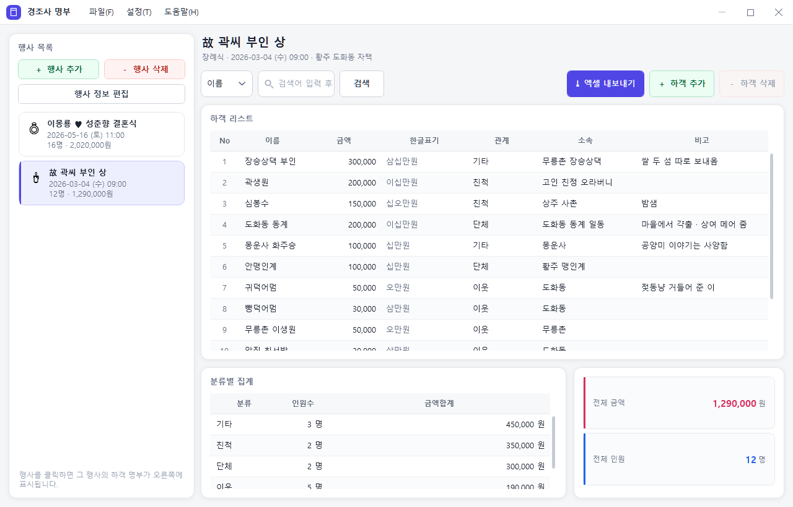

# 경조사 명부 (EventNote)

결혼식 · 장례식 같은 경조사의 **하객 명부와 경조사금**을 행사별로 정리하고, 엑셀로 내보내는 Windows 데스크톱 프로그램입니다.

축의금 봉투를 손으로 세고 수첩에 적던 일을 그대로 옮겨 놓은 화면입니다. 표에 바로 입력하고, 관계(분류)별로 자동 집계하고, 식권을 쓰는 행사라면 식대까지 차감해 남은 금액을 보여줍니다.

- .NET 8 · WPF · MVVM (CommunityToolkit.Mvvm)
- 데이터는 내 컴퓨터에만 저장됩니다. 서버도, 계정도, 인터넷 연결도 필요 없습니다.
- 제목줄 · 메뉴 · 대화상자까지 전부 앱이 직접 그립니다. 라이트/다크 어느 쪽에서도 Windows 기본 창이 끼어들지 않습니다.

## 화면

행사 하나를 고르면 오른쪽에 그 행사의 하객 명부와 집계가 나옵니다.



**설정 → 다크 모드**로 그 자리에서 전환됩니다. 다시 켤 때도 마지막에 고른 테마로 시작합니다.



행사 정보는 별도 창에서 편집합니다. 종류를 고르면 식권 사용 여부의 기본값이 따라옵니다.



묻고 알리는 창도 Windows 기본 `MessageBox` 가 아니라 앱이 직접 그립니다. 다크 모드에서도 창만 밝게 뜨는 일이 없고, 버튼 문구를 상황에 맞게 쓸 수 있습니다.



하객이 수만 명이면 엑셀 내보내기에 시간이 걸립니다. 그동안 본문이 흐려지고 가운데에서 동그라미가 돕니다. 제목줄은 흐려지지 않아 그대로 창을 옮기거나 닫을 수 있습니다.



**식권을 쓰지 않는 행사**(예: 장례식)에서는 식권 열 · 식권합계 열 · 식권 타일 · 식대 차감 타일이 화면과 엑셀에서 모두 사라집니다. 위 결혼식 화면과 비교해 보세요.



> 화면에 쓰인 내용은 `samples/` 의 예시 데이터입니다. 전래동화 인물로 꾸민 가상의 행사입니다.

## 주요 기능

| 기능 | 설명 |
|---|---|
| 행사 관리 | 결혼식 · 장례식 · 돌잔치 · 환갑 · 칠순 · 팔순 · 개업식 · 기타 8종. 날짜/시간, 장소, 주최(혼주·상주), 메모 |
| 하객 명부 | 표에서 바로 입력. 이름 · 금액 · 관계 · 소속 · 식권 · 비고 |
| 한글 표기 | 금액을 입력하면 `150,000 → 십오만원` 으로 자동 변환해 옆 칸에 보여줍니다 |
| 금액 입력 | 입력하는 동안 천 단위 쉼표를 넣어 줍니다 |
| 분류별 집계 | 관계별 인원수 · 금액합계 · 식권합계를 실시간 계산 |
| 식대 차감 | 식권 단가 × 식권 매수를 총액에서 뺀 "총 (식대 차감)" 을 보여줍니다 |
| 검색 | 이름 · 소속 · 관계 · 비고 · 전체 중에서 기준을 골라 필터링 |
| 자동 저장 | 마지막 입력 후 1.5초면 저장됩니다. `Ctrl+S` 로 즉시 저장도 가능 |
| 엑셀 내보내기 | 현재 행사 하나 또는 전체 행사를 `.xlsx` 로. 엑셀이 설치돼 있지 않아도 됩니다 |
| 데이터 이사 | 전체 데이터를 `.enote` 파일 하나로 내보내고, 다른 컴퓨터에서 가져오기 |
| 다크 모드 | 라이트/다크 전환. 고른 테마는 다음 실행 때도 유지됩니다 |
| 진행 표시 | 오래 걸리는 작업 동안 화면이 흐려지고 동그라미가 돕니다 |

### 단축키

| 키 | 동작 |
|---|---|
| `Ctrl+N` | 새 행사 |
| `Ctrl+E` | 현재 행사 엑셀로 내보내기 |
| `Ctrl+S` | 저장 |

## 시작하기

필요한 것: **Windows** + **.NET 8 SDK**

```bash
dotnet build EventNote.sln -c Release
```

```bash
dotnet run --project EventNote/EventNote.csproj -c Release
```

Visual Studio 에서는 `EventNote.sln` 을 열고 `EventNote` 를 시작 프로젝트로 두면 됩니다.

### 예시 데이터 넣어 보기

앱에서 **파일 → 데이터 가져오기(.enote)** 를 고르고 `samples/예시데이터.enote` 를 엽니다. 자세한 내용과 데이터를 고치는 방법은 [samples/README.md](samples/README.md) 에 있습니다.

## 데이터가 저장되는 곳

```
%APPDATA%\EventNote\events.dat
```

메뉴의 **설정 → 데이터 폴더 열기** 로 바로 갈 수 있습니다. 같은 폴더에 고른 테마를 적어 두는 `theme.txt` 도 함께 생깁니다.

- 이 파일은 **AES-256-GCM** 으로 암호화되어 있습니다. 메모장이나 엑셀로 열어도 내용을 알아볼 수 없고, 중간에 손을 대면 읽을 때 검출됩니다.
- 저장은 임시 파일에 먼저 쓴 뒤 바꿔치기합니다. 저장 도중 전원이 꺼져도 기존 파일이 남습니다. 직전 내용은 `.bak` 으로 보관됩니다.
- 키는 앱 안에 심어 둔 비밀에서 파생합니다. 비밀번호를 묻지 않는 대신, **프로그램 자체를 분석하는 사람까지 막아주지는 못합니다.** 남이 봐도 곤란하지 않을 수준의 개인 기록용입니다.
- 내보내는 `.enote` 파일도 같은 형식입니다. 그래서 다른 컴퓨터의 이 프로그램에서 그대로 열립니다.

## 프로젝트 구조

XAML 은 `Themes/` 아래 `ResourceDictionary` 로만 두고, 화면 클래스는 `ControlTemplate` 을 입은 코드 파일(`.cs`)로 둡니다. `.xaml.cs` 코드 비하인드가 없는 구조입니다.

| 프로젝트 | 대상 | 역할 |
|---|---|---|
| `EventNote` | `net8.0-windows` | 진입점. DI 조립, 리소스 병합, 셸 생성 |
| `EventNote.Forms` | `net8.0-windows` | 셸 창 `MainWindow` — 메뉴와 창 외형 |
| `EventNote.Main` | `net8.0-windows` | 본문 화면과 ViewModel (`MainContent`, `EventEditorWindow`) |
| `EventNote.Support` | `net8.0-windows` | 공용 UI 부품과 테마 (`AccentButton`, `CardPanel`, `StatTile`, `MoneyTextBox`, `SearchBar` …) |
| `EventNote.Core` | `net8.0` | 모델 · 저장소 · 암호화 · 엑셀 내보내기. **WPF 에 의존하지 않습니다** |

### 테마

색은 전부 `EventNote.Support/Themes/` 한 곳에 모여 있습니다.

| 파일 | 내용 |
|---|---|
| `Tokens.xaml` | 색이 아닌 값 — 글꼴, 글자 크기, 모서리 반경, 컨트롤 높이 |
| `Palette.Light.xaml` · `Palette.Dark.xaml` | 색. **두 파일의 키가 정확히 같아야 합니다** |
| `BaseStyles.xaml` | 기본 WPF 컨트롤의 외형 |
| `Units/*.xaml` | 공용 UI 부품의 `ControlTemplate` |
| `AppTheme.xaml` | 앱이 병합하는 진입점 |

색을 쓰는 쪽은 모두 `DynamicResource` 입니다. `ThemeManager.Apply` 가 `Application.Resources.MergedDictionaries` **맨 뒤**에 팔레트를 얹으면 화면 전체가 즉시 따라옵니다.

`AppTheme.xaml` 안쪽 팔레트를 직접 고치는 방식은 쓰지 않습니다. 중첩된 자식 딕셔너리를 바꾸면 WPF 가 이미 그려진 화면까지 무효화를 전파해 주지 않아, 시작할 때는 멀쩡하고 실행 중에 바꾸면 색이 그대로 남습니다.

### 창 크롬

Windows 기본 제목줄을 걷어내고 제목 · 메뉴 · 창 버튼을 한 줄에 직접 그립니다.

| 형 | 역할 |
|---|---|
| `ChromeWindow` | `WindowChrome` 설정과 최소화/최대화/닫기 명령. 창을 쓰는 쪽은 이걸 상속받습니다 |
| `TitleBar` | 마크 · 제목 · Content(메뉴 자리) · 창 버튼 |
| `CaptionButton` | 창 버튼 하나. 닫기만 빨갛게 반응합니다 |

두 가지가 걸림돌이었고, 코드에 주석으로 남겨 두었습니다.

- **제목줄 안에서 클릭이 먹지 않는 것** — `WindowChrome.IsHitTestVisibleInChrome` 을 달아야 합니다. 상속되는 속성이지만 `TitleBar` 안쪽 `ContentPresenter` 에 걸어 둔 값은 거기 얹히는 메뉴까지 내려오지 않아, 메뉴에 직접 달아야 했습니다.
- **최대화하면 창이 작업 영역보다 8px씩 커지는 것** — 원래는 창 테두리에 가려지는 여백인데, 제목줄을 맨 위까지 직접 그리므로 잘려 나갑니다. `ChromeWindow.ChromePadding` 이 삐져나간 양을 재서 바깥 `Border` 의 `Padding` 으로 돌려줍니다. `WM_GETMINMAXINFO` 로 최대화 크기를 제한하는 흔한 방법은 WPF `Window` 가 나중에 값을 되돌려 놓아 듣지 않았습니다.

### 움직임

애니메이션은 `Opacity` 와 `RenderTransform` 만 다룹니다. 둘 다 GPU 합성에 맡겨져 배치를 다시 계산하지 않습니다. `Width` · `Margin` 같은 배치 속성은 건드리지 않습니다. 표에 수백 줄이 떠 있을 때 프레임을 잡아먹는 쪽은 그런 것들입니다.

| 자리 | 움직임 | 길이 |
|---|---|---|
| 버튼 | 마우스오버 색이 겹쳐지며 드러남 · 누를 때 어두워짐 | 90ms / 40ms |
| 입력칸 · 콤보 · 날짜 | 포커스 링이 번짐 | 120ms |
| 콤보 | 열리면 갈매기가 뒤집힘 | 160ms |
| 행사 목록 | 고른 항목의 왼쪽 막대가 위아래로 펴짐 | 220ms |
| 체크박스 | 체크가 살짝 튀며 찍힘 (`BackEase`) | 200ms |
| 대화상자 | 열릴 때 떠오르며 나타남 | 220ms |
| 본문 | 창이 뜰 때 한 번 밝아짐 | 220ms |
| 진행 표시 | 판이 밝아지며 덮이고 동그라미가 돎 | 150ms / 0.9초 1바퀴 |

### 진행 표시

`BusyOverlay` 가 화면을 덮고, 덮이는 쪽(`MainContent`)이 자기 본문에 흐림 효과를 겁니다. 무엇을 흐리게 할지는 화면마다 다르고 덮는 판까지 함께 흐려지면 안 되므로, 흐림은 컨트롤 바깥에 둡니다.

세 가지를 조심해야 했습니다.

- **짧은 작업에서 번쩍이는 것** — `MainViewModel` 이 `IsBusy` 를 250ms 지연시켜 `ShowBusyOverlay` 로 넘깁니다. 그 안에 끝난 일은 표시 없이 지나갑니다.
- **흐림 효과의 상시 비용** — `Radius="0"` 짜리를 늘 달아 두고 값만 애니메이션하면 표를 스크롤할 때마다 그 효과를 거쳐 그립니다. 그래서 `DataTrigger` 로 바쁠 때만 `Effect` 를 붙입니다. 250ms 지연 덕분에 딱 붙어도 어색하지 않습니다.
- **회전이 멈추지 않는 것** — `RepeatBehavior="Forever"` 는 판이 사라져도 계속 돕니다. `StopStoryboard` 로 세워야 합니다.

작업이 끝나면 뒤이어 뜨는 알림창보다 **먼저** 진행 표시를 걷습니다. 안 그러면 흐려진 화면 위에 "다 됐습니다"라고 적힌 진행 표시가 남습니다.

**색 자체는 애니메이션하지 않습니다.** 팔레트의 브러시는 앱 전체가 나눠 쓰는 물건이라 그 `Color` 를 건드리면 같은 브러시를 쓰는 다른 곳까지 함께 변합니다. 대신 목표 색으로 칠한 판을 위에 겹쳐 두고 `Opacity` 만 올립니다 — `AccentButton.HoverBackground` 가 그 색입니다. 겹치는 판에는 테두리 두께만큼 `Margin` 을 줘야 합니다. 안 그러면 판이 버튼 테두리까지 덮어 마우스를 올리는 순간 테두리가 사라집니다.

들어올 때는 빠르게(90ms), 나갈 때는 느긋하게(160ms) 잡았습니다. 표를 훑다 커서가 버튼 위를 스쳐도 깜빡이지 않습니다.

### 대화상자

`MessageBox` 는 쓰지 않습니다. `MessageDialog` + `MessageDialogViewModel` 이 대신하고, 버튼은 개수도 문구도 부르는 쪽이 정합니다. 가져오기처럼 답이 셋인 경우 예/아니오/취소 대신 **합치기 · 교체 · 취소** 라고 그대로 씁니다.

예외 처리기만은 마지막 보루로 `MessageBox` 를 남겨 두었습니다. 앱이 이미 성치 않은 상태에서 우리 창을 띄우다 또 넘어지면 알릴 방법이 없어집니다.

솔루션 밖에 있는 것들:

| 경로 | 용도 |
|---|---|
| `samples/` | 예시 데이터 (`sample-data.json` → `예시데이터.enote`) |
| `tools/SampleDataBuilder/` | 위 `.enote` 를 굽는 콘솔 도구 |
| `tools/IconBuilder/` | `EventNote.ico` 생성 스크립트 |
| `Setup/` | Visual Studio Installer 프로젝트 |

### 의존 패키지

| 패키지 | 쓰는 곳 |
|---|---|
| `CommunityToolkit.Mvvm` | ViewModel (`ObservableObject`, `[RelayCommand]`) |
| `ClosedXML` | `.xlsx` 생성 |
| `Microsoft.Extensions.DependencyInjection` | 서비스 등록 |

## 빌드 메모

루트의 [`Directory.Build.props`](Directory.Build.props) 는 `OptimizeImplicitlyTriggeredBuild` 를 꺼 둡니다. 이게 없으면 Visual Studio 에서 **F5 로 시작할 때** 빌드 속도를 위해 분석기와 nullable 분석을 자동으로 건너뜁니다 ("분석기를 건너뛰어 빌드 속도를 높입니다"). 대신 F5 시작이 조금 느려집니다.

## 라이선스

[MIT](LICENSE) © 2026 devBong / 데브봉
